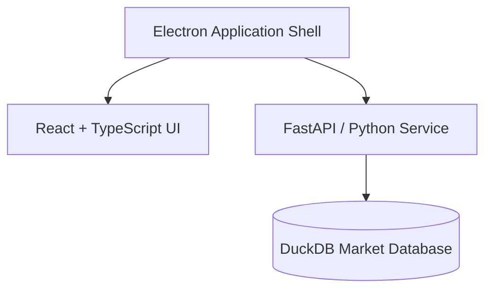

# 📈 ChartFlow Terminal

ChartFlow is a premium, high-performance desktop charting and backtesting terminal. It combines **TradingView-style interactive charting** with a **local DuckDB market data warehouse** and a **FastAPI backend** to provide lightning-fast, timezone-aware multi-resolution historical data analysis.

---

## ✨ Features

* **⚡ Ultra-Fast Ingestion**: Optimized direct SQL-based CSV importer using DuckDB's C++ parser (loads 1.7 million rows of 1-minute candle data in **under 1 second**!).
* **📅 Timezone & Session-Aware Resampling**: Automatically aggregates 1-minute base data into higher resolutions (5m, 15m, 30m, 1h, 4h, 1D, 1W) with Forex/Metals specific boundaries (America/New_York 5:00 PM EST session rollovers).
* **💻 Interactive Charts**: Full-featured TradingView lightweight charts integration supporting multiple drawing tools, custom styles, layouts auto-save, and history retrieval.
* **🌗 Multi-Theme Support**: Instant switching between **Bloomberg-style Dark Terminal theme** and **Developer Sandbox Light theme** with synchronized chart theme toggling.
* **🔧 Core Metadata Control**: Easily adjust price scales (pricescale decimal precision), custom exchange listings, timezone offsets, session hours, and logo markers.

---

## 🛠️ Architecture & Tech Stack

ChartFlow runs as a hybrid Electron desktop app splitting tasks between a fast TypeScript UI and a Python analytical microservice:



* **Frontend**: React, Vite, TypeScript, TailwindCSS, Lucide Icons, TradingView Charting Library.
* **Backend**: FastAPI, Uvicorn, Python 3.12, Pandas (for timezone session shifts), DuckDB (analytical database).
* **Shell**: Electron (v43) and Electron Builder for cross-platform installers.

---

## 🚀 Getting Started

### Prerequisites
* [Node.js](https://nodejs.org/) (v20 or higher)
* [Python](https://www.python.org/) (v3.12 or higher)

### Local Development Setup

1. **Clone the repository** (if not already done):
   ```bash
   git clone https://github.com/Web-Traveller/ChartFlow.git
   cd ChartFlow
   ```

2. **Install Node dependencies**:
   ```bash
   npm install
   ```

3. **Configure Python backend**:
   Navigate to the `backend` directory, create a virtual environment, and install dependencies:
   ```bash
   cd backend
   python -m venv venv
   
   # Linux/macOS:
   source venv/bin/activate
   # Windows:
   .\venv\Scripts\activate

   pip install -r requirements.txt
   ```

4. **Launch the application in development mode**:
   Return to the root directory and start the hot-reloading dev workspace:
   ```bash
   npm run electron:dev
   ```

---

## 📦 Packaging & Building

### Cross-Platform Desktop Builds
The application uses `electron-builder` to package the React frontend and bundle the Python server alongside the local DuckDB database.

* **Build the production application package**:
   ```bash
   npm run electron:build
   ```

### Output Formats
* **Windows**: NSIS installer executable (`.exe` under `dist-desktop/`).
* **Linux**: AppImage bundle (`.AppImage` under `dist-desktop/`).

---

## 🔒 License
Private / Proprietary. All rights reserved.
